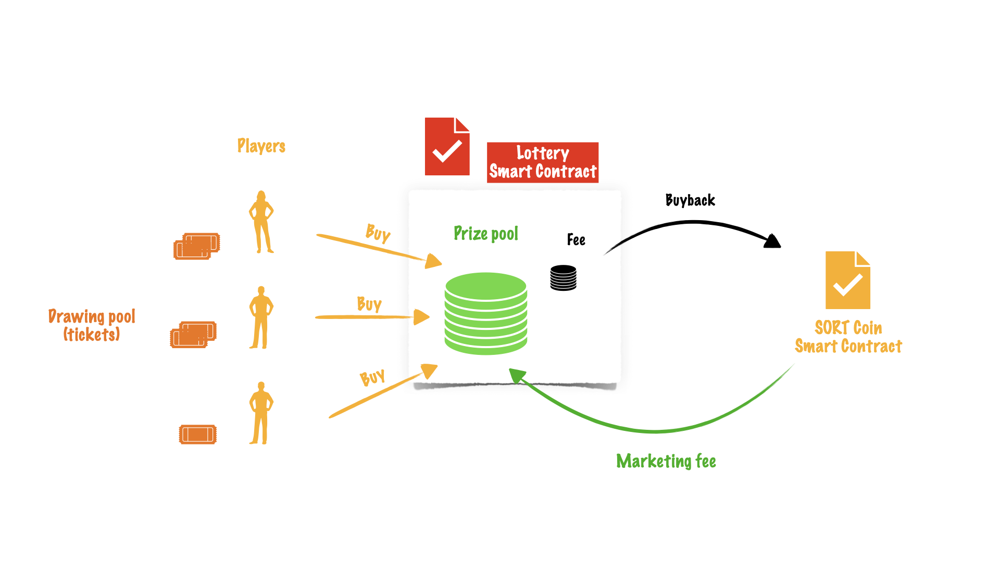
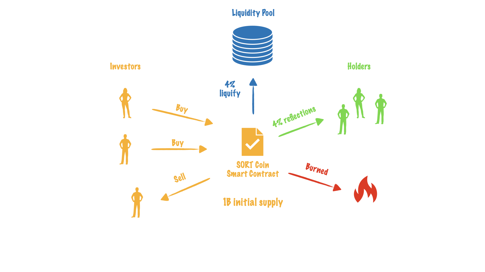

Lottery on Chains Whitepaper
============================

**Lottery on Chains** is a lottery game on the blockchain. The **Smart Contract** defines the rules of the game.
And rules are pretty simple: players are buying tickets using the blockchain tokens.
The token is defined by the blockchain, for example, the BNB on the Binance Smart Chain.
The tokens from sales go to the prize pool and will be used to pay prizes in a specific drawing.

Once the time is over the game will be closed. After that point, players can't buy new tickets anymore.
And the contract will start the drawing to determine which previously sold lottery ticket is a winner.
It uses the random number generator (RNG) to get the winning number. In the new version,
the `Chainlink VRF <https://docs.chain.link/docs/chainlink-vrf/>`_ will be used as RNG. Once the winner is determined, the prize pool is locked as
unclaimed, and only the winner can claim it. The unclaimed prizes are stored indefinitely in the contract
memory and can be claimed at any time.

At the end of the game, all tickets are being burned and the new game is started.

The rules of the game, e.g. ticket price, payout % to the prize pool, can be changed by the organizer,
but only before the game is started. The organizer can't change the rules of the already running game.
So when the new player buys a ticket, he confirms the rules of the current and he can make sure that they
are not changed until the end of the game.

Prize pool
----------

The amount of tokens that goes to the prize pool is defined as

:math:`prizePool = soldTickets * (payout / 100)`

The payout percentage is the contract parameter and can be set by the organizer for the next game.
Usually, it's more than 90% (organizer fee in that case is less than 10%).

The organizer, or contract creator, doesn't have access to the prize pool. He can only withdraw the profit (sales fee).
If the partnership exists partner is also eligible for part of the profit (commission %), but it does not affect
the players payout, because partner gets the part of the organizer profit. Having a partner means organizer getting less profit.

Partnership
-----------

The partnership can be established by writing the partner address and his commission rate to the contract memory.
One of the partnership could be for example, advertisement support.

:math:`partnerProfit = soldTickets * ((100 - payout) / 100) * (commission / 100)`

For example, if commission is 50% and payout is 90%, the partner will get the 5% of the total sales.

Links
-----

The Smart Contract is open and verified - `See Contract Source Code (Solidity) <https://bscscan.com/address/0xCe37cb56a115524ab31F31d321D8e19bB08B5D61#code#L1>`_.

To try it out `Checkout the official website <https://www.lotteryonchains.com/>`_.

Check out the :doc:`usage` section for playing guide, including
how to :ref:`connect`.

.. note::

   This project is under active development.

Contents
--------

.. toctree::

   usage
