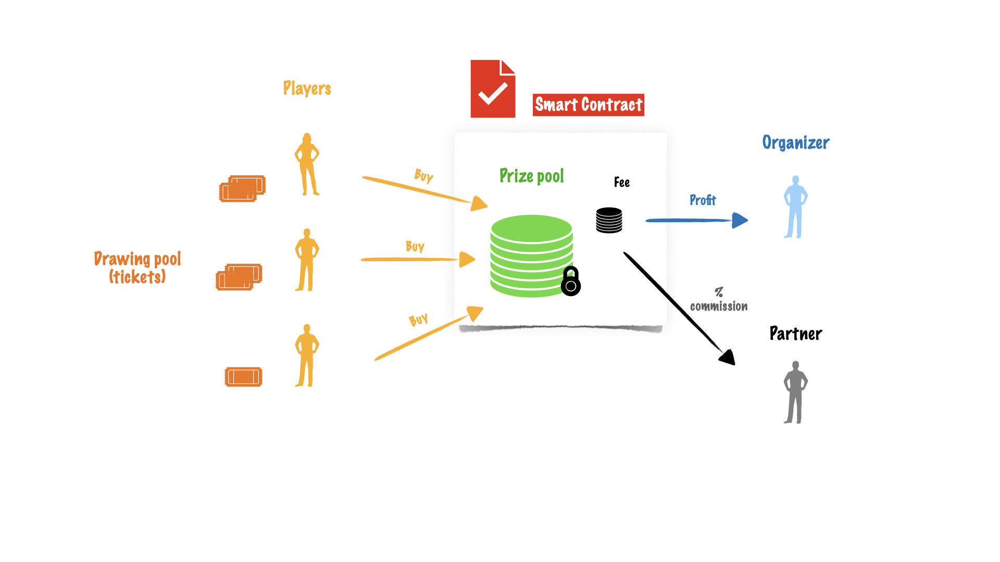

Lottery on Chains Whitepaper
============================

**Lottery on Chains** is a lottery game on the blockchain. The **Smart Contract** defines the rules of the game.
And rules are pretty simple: players are buying tickets using the blockchain tokens.
The token is defined by the blockchain, for example, the BNB on the Binance Smart Chain.
The tokens from sales go to the prize pool and will be used to pay prizes in a specific drawing.

The organizer, or contract creator, doesn't have access to the prize pool. He can only withdraw the profit.
If the partnership exists partner is also eligible for part of the profit (commission %).

The Smart Contract is open and verified - `See Contract Source Code (Solidity) <https://bscscan.com/address/0xCe37cb56a115524ab31F31d321D8e19bB08B5D61#code#L1>`_.

To try it out `Checkout the official website <https://www.lotteryonchains.com/>`_.

Check out the :doc:`usage` section for playing guide, including
how to :ref:`connect`.

.. note::

   This project is under active development.

Contents
--------

.. toctree::

   usage
