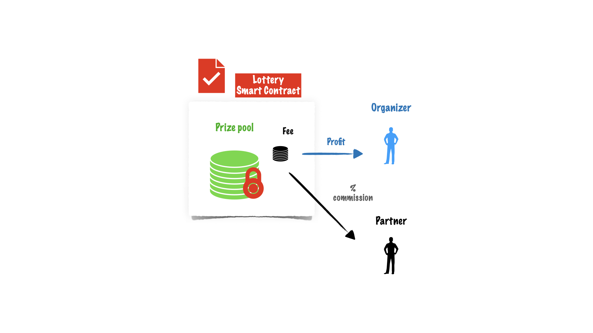

Partnership
===========

The partnership can be established by writing the partner address and his commission rate to the contract memory.
One of the partnership could be, for example, advertisement support.

.. math::

    profit = soldTickets * ((100 - payout) / 100)

    partnerProfit = profit * (commission / 100)

For example, if commission is 50% and payout is 90%, the partner will get the 5% of the total sales.

