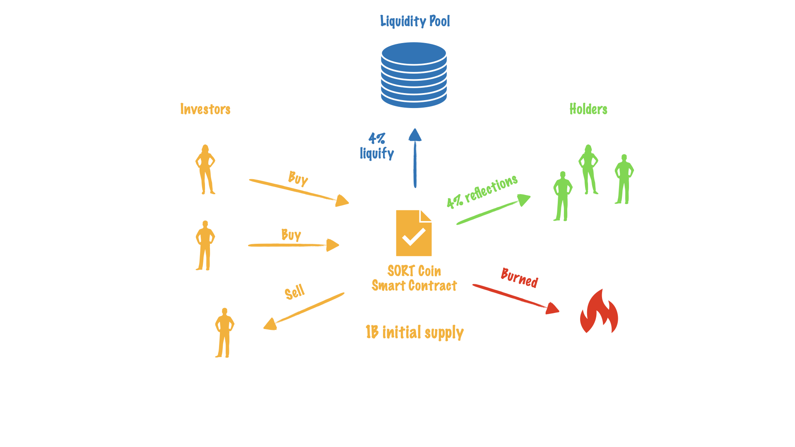

SORT Tokenomics
===============

SORT coin is a utility token the dApp lottery game. It uses modern token mechanics:
reflection, automatic liquidity addition and token deflation. Additionally it will
provide some in-game mechanics to the holders.

Anti-Whale Mechanics
--------------------
The maximum transaction limit is implemented to protect from a large sell transaction,
resulting in a dramatic drop in the prices of the token. These constraints protect
token from manipulation by large holders, usually referred to as whales.

Static-rewards
--------------
Holding rewards strategy is used. The reflect function takes 4% of every SORT token transaction, splits that fee and
awards it to all holders of the token.

Automatic Liquidity Generation
------------------------------
Each transaction is subject to a 4% fee, which is used to increase liquidity on PancakeSwap.

Deflation
---------
3% of total supply tokens are burned by sending to the `0x000000000000000000000000000000000000dead` address.
Since SORT uses a reflection function it constantly receives a small portion of the reflection fee. As
more tokens are transferred, more will get burned thus reducing the total supply.

Buyback
-------
Once the lottery contract become popular it will use the transactions fee to repurchase and burn SORT tokens.
These purchasing transactions will add additional value (BNBs) to the liquidity pool and reduce
the total circulating supply of tokens.
