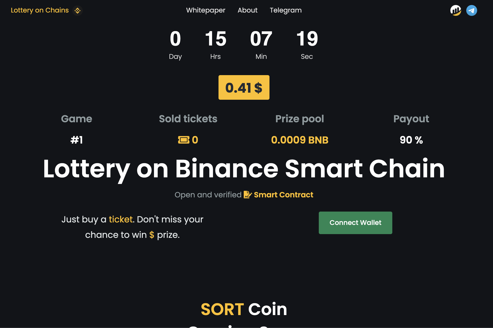
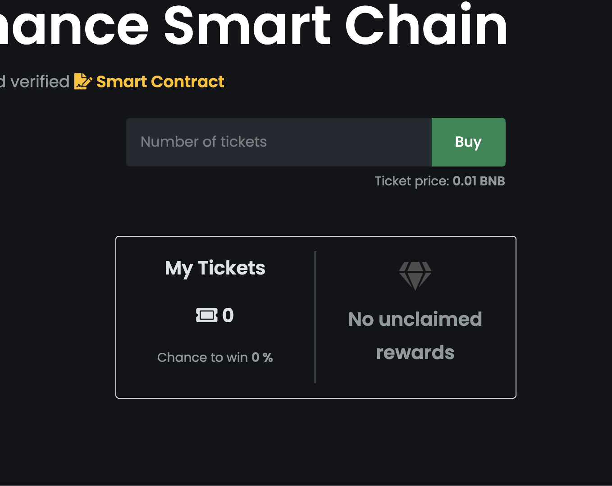
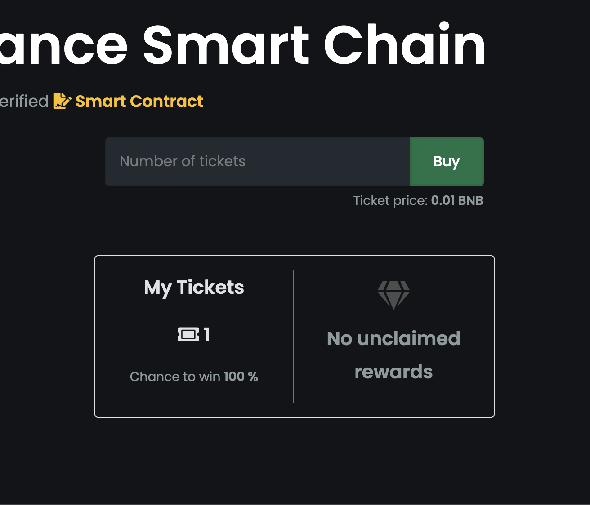

How To Play Lottery
===================

.. _connect:

Connect wallet
--------------

You need a crypto wallet on Binance Smart Chain network to play a **Lottery** game.
The most popular wallet is a `MetaMask <https://https://metamask.io//>`_. Please check the guide
`Connecting MetaMask to Binance Smart Chain <https://academy.binance.com/en/articles/connecting-metamask-to-binance-smart-chain>`_.

You can also can use any other wallet with WalletConnect.
See the list of supported `Wallets <https://registry.walletconnect.org/wallets>`_.

If you created wallet or already have one, click the **Connect Wallet** button and choose the desired wallet type.
At the end you will need to approve access to account information in your wallet.

|

Buying Lottery tickets
----------------------

When you connected your wallet, you can see your account information: already purchased tickets and
rewards like on the screenshot below.

|

You can also buy tickets now. Make sure that you agree with ticket price displayed.

#. To buy a ticket enter the amount of tickets you would like to buy into the field.
   You will see the estimated gas fee and the ticket price after your enter some value.
   The more tickets you buy, the greater the discount.

   The discount starts at 2 tickets, and scales all the way to 100 tickets where
   you will save almost 50% on your purchase.

   .. image:: screenshots/buy-started.png
      :width: 45%
      :alt: Buy started
   .. image:: screenshots/buy-started-discount.png
      :width: 45%
      :alt: Buy started

#. Click the **Buy** and confirm your action in your wallet.

   .. figure:: screenshots/buy-processing.png
      :width: 50%
      :align: center
      :alt: Buy processing

Viewing your tickets after buying
---------------------------------

Once the transaction confirmed the amount of bought tickets will be reflected on your account balance.

Claiming reward
---------------

‌When the game has ended you can check your rewards to see if you won.

1. Click **Connect Wallet** to see your account details.

2. If you won you will see the rewards amount together with **Claim** button.

   .. figure:: screenshots/claim.png
      :width: 640
      :align: center
      :alt: Buy finished

3. Click **Claim** button to transfer rewards to your account address.
